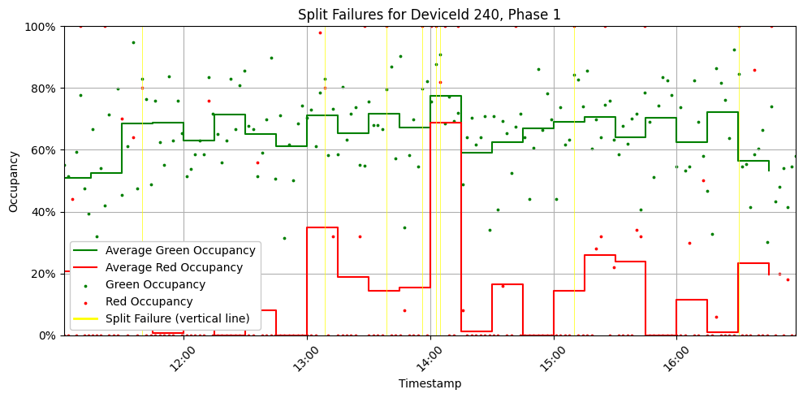

# ATSPM Aggregation

`atspm` is a Python package to transform hi-res ATC signal controller data into aggregate ATSPMs (Automated Traffic Signal Performance Measures). It works on multiple devices/detectors at once, executing SQL queries in parallel using DuckDB.

## Installation

```bash
pip install atspm
```

## Quick Usage Overview for Split Failures

```python
# Import libraries
from atspm import Aggregations, sample_data

# Instantiate Aggregations class and load hi-res data and detector configurations into it
aggr = Aggregations(data=sample_data.data, phase_detector_config=sample_data.config)

# Return aggregate split failures
sf = aggr.split_failure()

# Plot to inspect results (optional)
aggr.plot_occupancy(sf, DeviceId=240, Phase=1)
```


